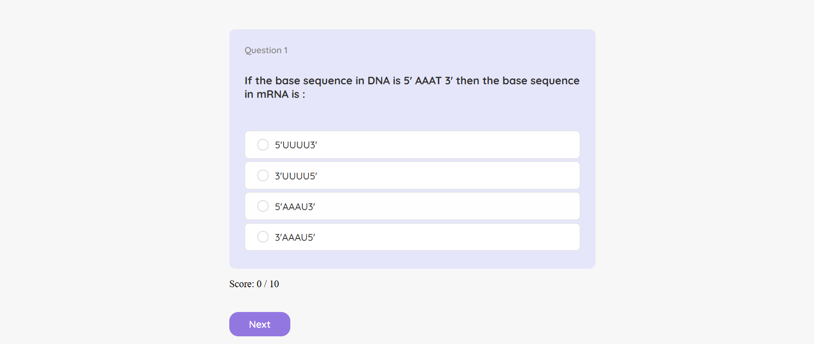

# Quiz Application

This is an interactive quiz application built with [Vite](https://vitejs.dev) and [React.js](https://react.dev). The application fetches quiz data from an API, provides multiple-choice questions, and includes gamification features such as score tracking and progress visualization.

## Features

- Fetches quiz data dynamically from an API.
- Displays multiple-choice questions with a clean UI.
- Allows users to select an answer and highlights correct/incorrect choices.
- Tracks and displays the user’s score.
- Progress bar to visualize quiz completion.
- Responsive and optimized UI for a smooth user experience.

## Getting Started

Follow the instructions below to set up and run the application locally.

### Prerequisites

Ensure you have the following installed:
- [Node.js](https://nodejs.org/) (v18 or above recommended)

### Installation

1. Clone the repository:
   ```bash
   git clone https://github.com/navya-dhawde/Quiz-App.git
   cd to-do
   ```
2. Install dependencies:
   ```bash
   npm install
   ```
3. Start the development server:
   ```bash
   npm run dev
   ```
4. Open the app in your browser at (http://localhost:3000).

## Technologies Used

- **Framework**: [React.js](https://react.dev)
- **Build Tool**: [Vite](https://vitejs.dev)
- **Styling**: CSS
- **State Management**: React useState & useEffect hooks
- **Language**: JavaScript

## Scripts

Below are the available scripts for this project:

- **Run Development Server**:
  ```bash
  npm run dev
  ```

- **Build for Production**:
  ```bash
  npm run build
  ```

## Screenshots
### HomePage

*This is the first screenshot showing the Start Screen. Here is where we can start the quiz*

### Add Task

*This screenshot shows the interface where we can select an option and navigate to the next question.*

### Edit Task

*Here is a screenshot of the interface where our final score is displayed after submission and we also have the option to restart the quiz.*

## Assumptions

- **Fetching Data**: The quiz data is fetched from a predefined API.
- **Answer Selection**: Users can select only one answer per question.
- **Navigation**: Users manually move to the next question using a "Next" button after selection.
- **Score Calculation**: The score is updated in real time based on correct answers.

## Conclusion

This quiz application provides an engaging experience with interactive features, built using React.js and Vite for optimized performance. It demonstrates key concepts such as API fetching, state management, and UI responsiveness.

Hope you enjoy this project! 😊
